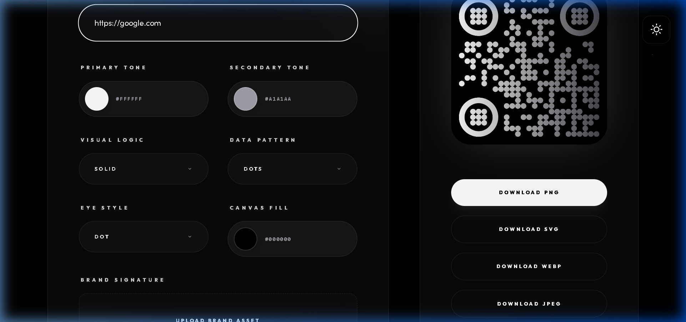
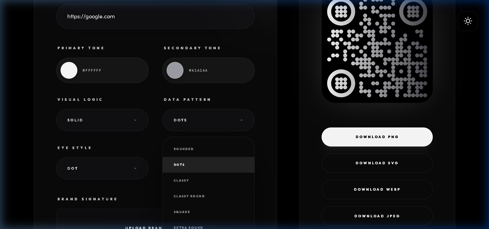

# 🚀 Premium QR Generator

A high-end, obsidian-themed QR code generator built with React and Vite. Create professional, branded QR codes with a premium glassmorphism interface.


## ✨ Key Features

- **Obsidian Tech Theme**: A stunning dark/light mode interface with high-contrast glassmorphism.
- **Real-time Customization**: Watch your QR code update instantly as you change colors and patterns.
- **Multiple Formats**: Export your designs in **PNG, SVG, WEBP, or JPEG**.
- **Brand Integration**: Upload your logo to create a unique brand signature.
- **Responsive Design**: Fully optimized for mobile, tablet, and desktop viewports.
- **SEO Optimized**: Built with search engines in mind to help your brand stand out.

---

## 🛠️ How to Use: Step-by-Step Guide

### 1. Enter Your Content
Start by typing your URL, social profile link, or text into the **Identity Input** field. The QR code will update in real-time as you type.



### 2. Choose a Style Preset
Use the quick-access theme buttons (**Neon, Corporate, Minimal, Royal**) to instantly apply a curated design palette that matches your brand's vibe.

### 3. Customize Patterns & Colors
Dive into the **Design System** panel:
- **Primary Tone**: Set the main color of your QR dots.
- **Dot Style**: Choose from square, rounded, dots, or classy shapes.
- **Corner Squares**: Customize the outer and inner square shapes for a unique look.



### 4. Add Your Brand Logo
Click the **Upload Brand Asset** area to add your logo to the center of the QR code. The engine will automatically optimize the spacing to ensure scanability.

### 5. Export & Download
Once you're happy with the design, click one of the high-resolution download buttons (**PNG, SVG, etc.**). Your file will be saved instantly with a clean, professional filename.

---

## 🚀 Getting Started

### Installation
```bash
npm install
```

### Development
```bash
npm run dev
```

### Build
```bash
npm run build
```

---

## 👨‍💻 Built By
Created with precision by **[ajmalfaris11](https://github.com/ajmalfaris11)**.
Personal Website: **[ajmalfaris.me](https://ajmalfaris.me)**
